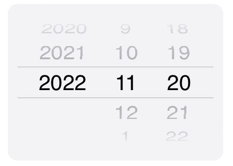

# LixfloraPicker
Apple-Style Picker to your web

# How to apply
1. Inject the script to you project
2. Make a div whose height is 160px and class is LixfloraPicker
3. Make your own select objects inside the div
4. Execute the function: LixfloraPickerStart();

# Example
See "sample.htm" file

# Version History
* v1.0 (2022.11.20)
> Uploaded to GitHub. 

# Credit
* https://github.com/JinHo-Dev/LixfloraPicker

# License
GPLv3

&copy;<a href="https://github.com/JinHo-Dev/">JinHo-Dev(Lixflora)</a>

# Contact
### e-mail
dpdlalslr@gmail.com

### GitHub
https://github.com/JinHo-Dev/